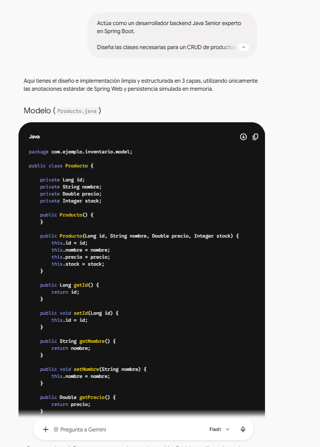

# Tarea: Mi prompt profesional

## Funcionalidad elegida

**CRUD de Productos para un Sistema de Inventario.**
El objetivo es solicitar a un Asistente de IA el diseño y desarrollo del código fuente backend (Java con Spring Boot) para gestionar operaciones de Alta, Baja, Lectura y Actualización de productos en una base de datos.

---

## Version 1: prompt basico

`Hazme un CRUD de productos para un sistema de inventario.`

- **Qué cambié / Qué pasó:** Solicitud básica y corta sin especificar lenguaje, framework ni arquitectura.
- **Por qué:** Para observar la respuesta predeterminada de la IA sin contexto previo.
- **Qué mejoró / Qué faltó:** Entregó un ejemplo genérico en Node.js/Express que no servía para nuestro proyecto en Java, omitió validaciones y no estructuró el código.

---

## Version 2

`Actúa como desarrollador Java Senior. Crea un CRUD de productos con Spring Boot en Java. Incluye los métodos para listar, crear, buscar por ID, actualizar y eliminar productos.`

- **Qué cambié:** Definición de un Rol (`Desarrollador Java Senior`) e Instrucción con tecnología explícita (`Java`, `Spring Boot`).
- **Por qué:** Para restringir el lenguaje de programación y evitar soluciones en otros entornos.
- **Qué mejoró / Qué faltó:** El código generado fue en Java y Spring Boot, pero colocó todo en un único archivo sin arquitectura clara, faltó precisar la estructura del modelo y usó dependencias externas no solicitadas.

---

## Version 3: prompt final

> **Prompt Final:**  
> Actúa como un desarrollador backend Java Senior experto en Spring Boot.  
> Diseña las clases necesarias para un CRUD de productos en una API REST de inventario. Incluye endpoints para: listar todos los productos, buscar por ID, crear un producto, actualizar y eliminar por ID.  
> Contexto: Módulo de inventario local. Cada producto debe contener strictly los atributos: id (Long), nombre (String), precio (Double) y stock (Integer).  
> Ejemplo JSON de entrada: `{"nombre": "Teclado Mecánico", "precio": 45.50, "stock": 100}`  
> Ejemplo JSON de salida: `{"id": 1, "nombre": "Teclado Mecánico", "precio": 45.50, "stock": 100}`  
> Restricciones: 1. NO uses librerías externas adicionales a Spring Web. 2. NO uses BD externa; simula la persistencia en memoria. 3. Estructura en 3 capas: Controller, Service y Modelo. Devuelve la respuesta dividida por clases.

- **Qué cambié:** Se integraron los 5 componentes principales (Rol, Instrucción, Contexto, Ejemplos y Formato) junto con restricciones negativas explícitas.
- **Por qué:** Para garantizar un código modular, mantenible, sin librerías innecesarias y listo para ser integrado.
- **Qué mejoró:** Cumplió con la arquitectura en 3 capas, usó el almacenamiento en memoria solicitado, respetó el formato JSON y aplicó las mejores prácticas de Spring Boot.

---

## Componentes del prompt final

| Componente                  | Texto extraído del Prompt Final                                                                                                                                               |
| :-------------------------- | :---------------------------------------------------------------------------------------------------------------------------------------------------------------------------- |
| **Rol**                     | `Actúa como un desarrollador backend Java Senior experto en Spring Boot.`                                                                                                     |
| **Instrucción**             | `Diseña las clases necesarias para un CRUD de productos en una API REST de inventario. Incluye endpoints para: listar todos, buscar por ID, crear, actualizar y eliminar.`    |
| **Contexto**                | `Contexto: Módulo de inventario local. Cada producto debe contener estrictamente los atributos: id (Long), nombre (String), precio (Double) y stock (Integer).`               |
| **Ejemplos**                | `Ejemplo JSON de entrada: {"nombre": "Teclado Mecánico", "precio": 45.50, "stock": 100} ... Ejemplo JSON de salida: {"id": 1, ...}`                                           |
| **Formato / Restricciones** | `Restricciones: 1. NO uses librerías externas... 2. NO uses BD externa... 3. Estructurado en 3 capas... Devuelve la respuesta dividida claramente con encabezados por clase.` |

---

## Evaluacion del resultado

| Criterio de Evaluación                          | Cumple (Sí / No) | Observaciones                                                              |
| :---------------------------------------------- | :--------------: | :------------------------------------------------------------------------- |
| **¿Usa Java y Spring Boot?**                    |      **Sí**      | Utiliza las anotaciones nativas de Spring (`@RestController`, `@Service`). |
| **¿Cumple las restricciones de librerías?**     |      **Sí**      | Únicamente requiere dependencias estándar de Spring Web.                   |
| **¿Aplica la estructura en 3 capas?**           |      **Sí**      | Separa de forma limpia Controlador, Servicio y Modelo/Repositorio.         |
| **¿Respeta el esquema JSON de entrada/salida?** |      **Sí**      | Mantiene exactamente los nombres y tipos de atributos definidos.           |

---

## Errores que evite

1. **Ser demasiado general:**  
   En la versión 1 no se especificó tecnología ni atributos, lo que generó código irrelevante. Se evitó definiendo el lenguaje (Java), framework (Spring Boot) y esquema de atributos exacto.
2. **No indicar restricciones ni formato de entrega:**  
   Sin límites, la IA tiende a incluir librerías adicionales o bases de datos no deseadas. Se evitó agregando restricciones negativas explícitas (_"NO usar BD externa"_, _"NO usar librerías extras"_) y solicitando separación por clases.

---

## Evidencias de Ejecución

### Respuesta de la IA al prompt final

### Archivo TAREA.md renderizado en GitHub

